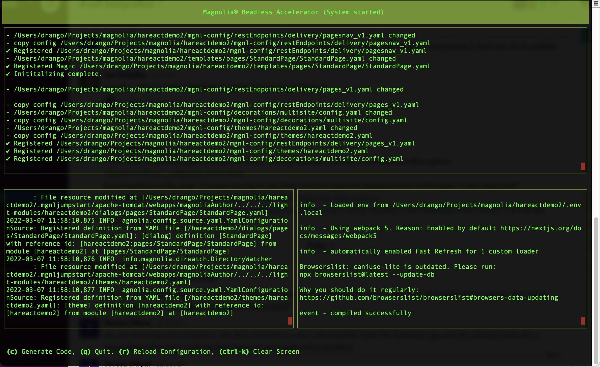
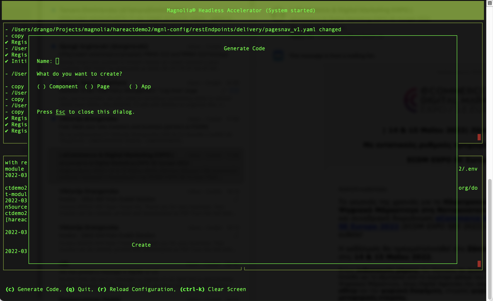

This is a [Magnolia CMS frontend](https://ha.magnolia-cms.com/) project bootstrapped with [`ha jumpstrart`](https://ha.magnolia-cms.com/).

## Structure
`.mgnljumpstart` folder contains barebone apache tomcat server with magnolia author instance installed in webapp tomcat's folder.
So, magnolia cms is already installed by [`ha jumpstrart`](https://ha.magnolia-cms.com/) and configured to use it as headless project.

## Getting Started

To run the project you need to
```bash
ha dev
```
in the terminal window. This will open ha console:



What `ha dev` command does is:

- starts magnolia cms by using magnolia's CLI: `mgnl start`
- starts frontend project `yarn dev` or `npm run dev`
- starts `ha install --watch` command in watch mode

After running `ha dev` you should be able to:
- access magnolia under url: http://localhost:8080/magnoliaAuthor/
- see frontend project started under url: http://localhost:3000/

## Development

To add new component/page/app you can use the ha console.
By typing `c` in the ha console, interactive dialog will be presented.



You can use this dialog to choose what type of file you want to generate and how to name it.
<br/>
In the background ha console is using `ha generate` command to generate new file in the project.
<br/>
After code generation is done, go to newly created file(s) and feel free to do the changes that meet your needs ...


